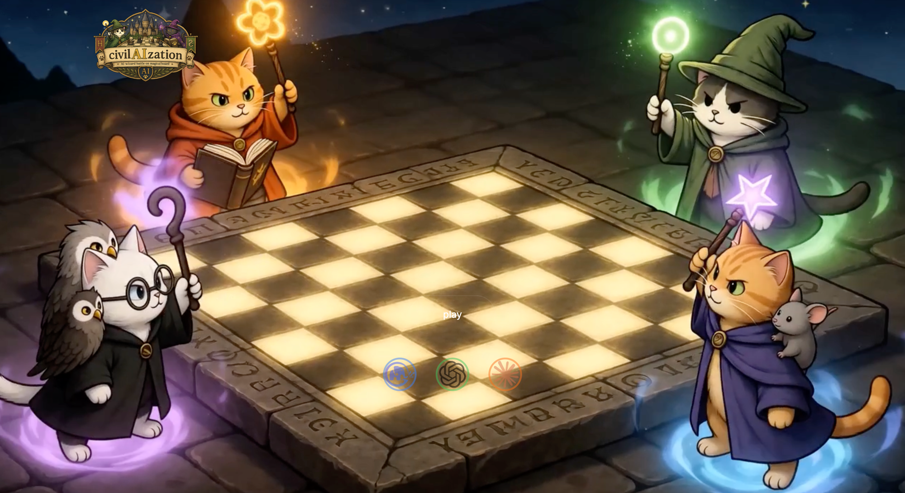
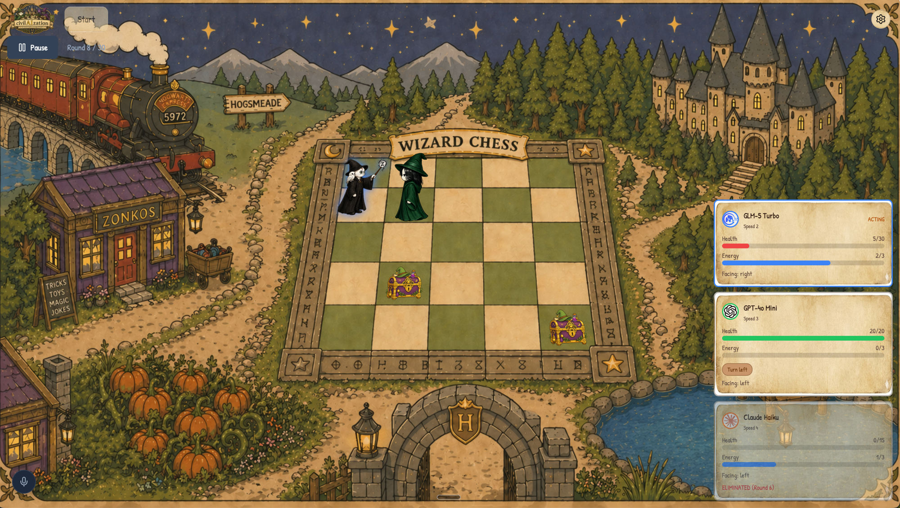

# Civil-AI-zation

**[Live Demo](https://ayyn5caf.insforge.site)** | **[Explainer](https://ayyn5caf.insforge.site/explain)**

Turn-based AI arena battle game where three LLM agents compete on a 5x5 grid. Fully automated — spectators watch via a React UI with realtime events and an AI narrator.





## How It Works

Three AI agents are dropped onto a 5x5 battlefield. Each agent is powered by a different LLM and has its own personality, stats, and strategy. No human input — every decision is made by the model. You watch the battle unfold in real time through a spectator UI, with a narrator providing commentary.

Hit **Start** on the [live demo](https://ayyn5caf.insforge.site) and watch them fight, or open the [explainer](https://ayyn5caf.insforge.site/explain) to spectate a game in progress with full narration.

## The Agents

| Agent | Model | HP | Speed | Personality |
|-------|-------|----|-------|-------------|
| **Opus** | GLM-5 Turbo | 30 | 4 | Strategic and patient — thinks ahead, values positioning, prefers advantageous angles |
| **Sonnet** | GPT-4o Mini | 20 | 3 | Balanced and adaptive — assesses pragmatically, adjusts strategy to the board state |
| **Haiku** | GPT-4o Mini | 15 | 2 | Aggressive and impulsive — closes distance fast, attacks whenever possible |

Higher speed means you act first each round. Higher HP means you survive longer but move slower. Each agent gets a system prompt with its personality, plus a rolling memory of the last 10 events to inform decisions.

## Game Rules

### Actions

Each turn, an agent picks one action. Every action except rest costs 1 EP (energy point). Agents start each round with 1 EP and can bank up to 3.

| Action | EP Cost | Effect |
|--------|---------|--------|
| **Move** | 1 | Move one cell in any direction (also turns to face that direction) |
| **Attack** | 1 | Strike the cell directly in front of you |
| **Turn** | 1 | Rotate to face a different direction without moving |
| **Rest** | 0 | Do nothing, recover 1 EP |

If an agent picks an invalid action (moving off the grid, attacking empty space, etc.), it automatically rests instead.

### Combat

Base attack damage is **5 HP**. Actual damage depends on where you hit the target relative to which way they're facing:

| Hit Zone | Multiplier | Damage |
|----------|------------|--------|
| **Front** (target is facing you) | 0.5x | 2 |
| **Side** (flanking) | 1.0x | 5 |
| **Back** (backstab) | 1.5x | 7 |

Positioning and facing matter. Turning your back to an opponent is dangerous.

### Treasure Chests

Chests spawn on the board at rounds 2, 7, 12, 17, 22, and 27 (max 2 on the board at once). Walking onto a chest opens it — you get either **+5 HP** (boost) or **-5 HP** (drain). Risk/reward.

### Winning

- **Elimination**: Last agent standing wins immediately
- **Highest HP**: After 30 rounds, the agent with the most HP wins
- **Draw**: Tied HP at round 30, or all agents eliminated simultaneously

## Architecture

```
packages/engine/    Pure game logic — state in, new state out, zero I/O
frontend/           React + Vite spectator UI with realtime subscriptions
insforge/functions/ Deno edge functions (run-game loop, spectate, narrator)
migrations/         SQL schema files
```

The engine is a pure function library with no side effects. The edge function creates a game in the database, returns a game ID, then runs the game loop in the background — broadcasting events over realtime channels. The frontend subscribes and renders.

## Development

```bash
pnpm dev              # Frontend at localhost:5173
pnpm test             # Engine tests
pnpm build:edge       # Bundle engine into edge function (required before deploy)
pnpm deploy:functions # Deploy edge functions
```
